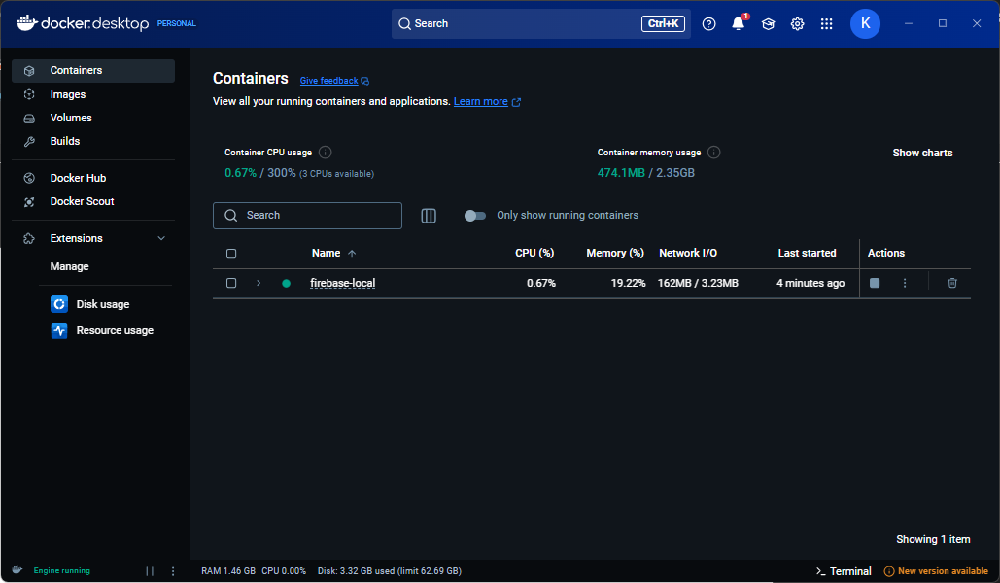
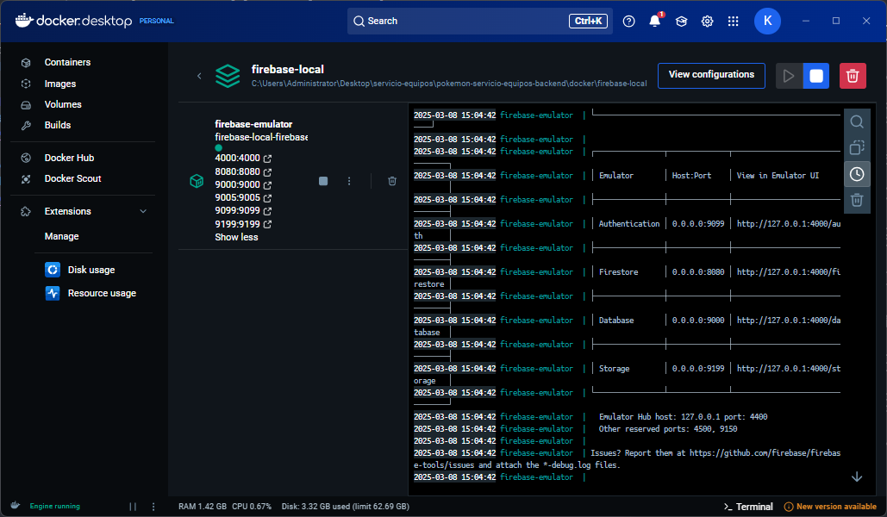
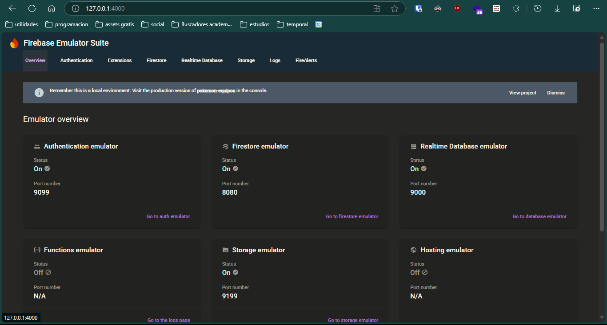
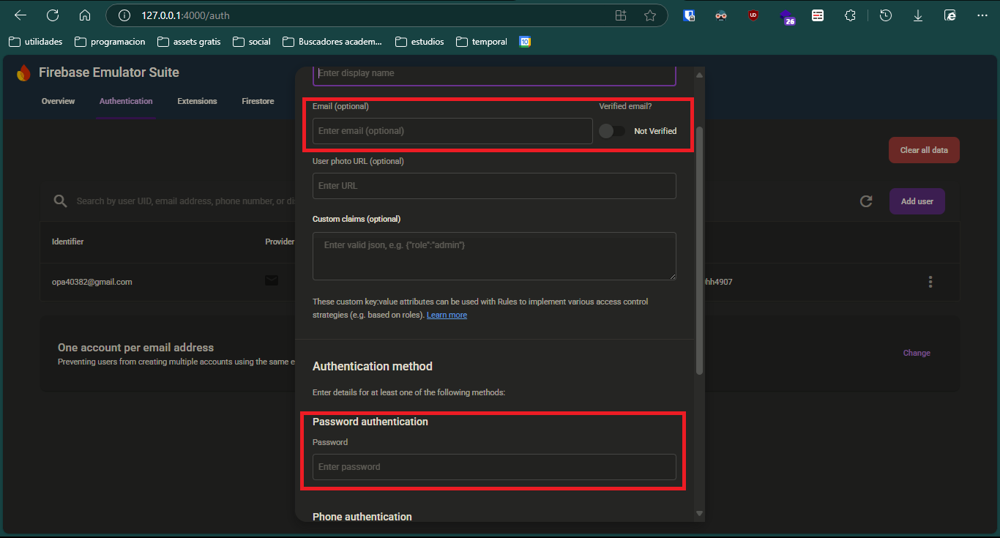
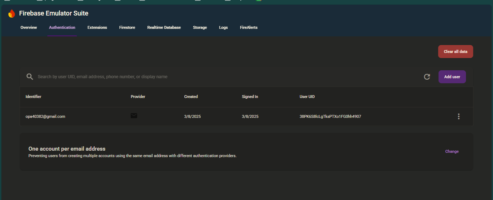
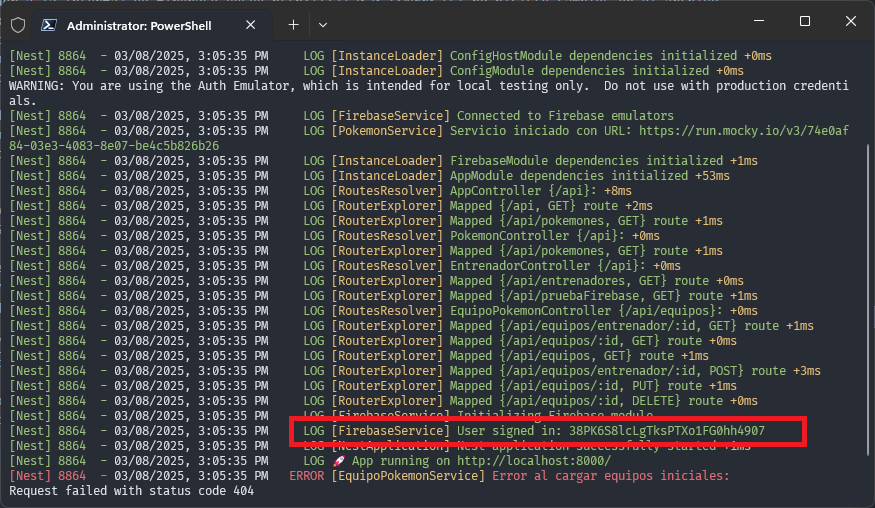
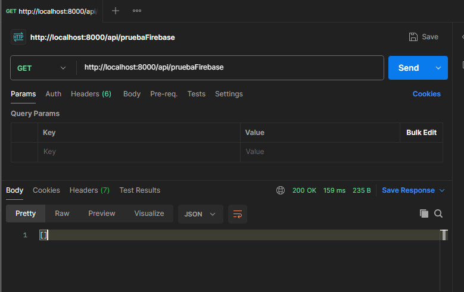
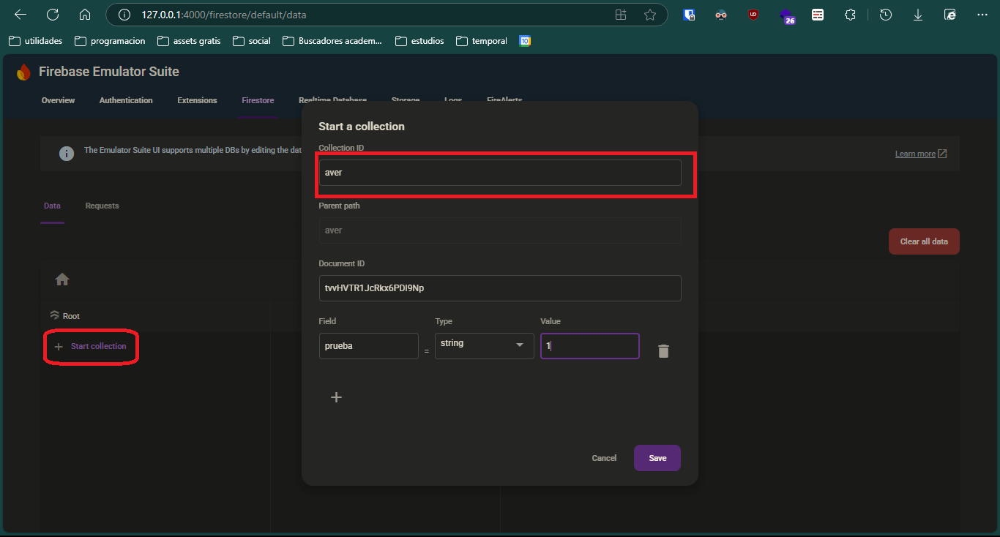
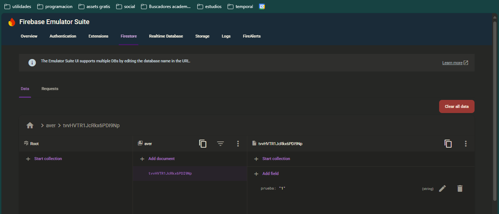
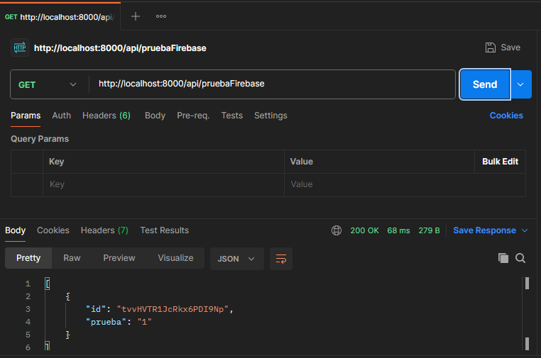

# Uso del servicio de Firebase local con Docker

Este documento explica cómo utilizar el servicio de Firebase local montado en Docker.

## 1. Verificación del servicio en Docker

Después de seguir los pasos del README principal, el servicio de Firebase local debería estar funcionando. En Docker Desktop, deberías ver algo similar a la siguiente imagen:



## 2. Inspección de los servicios emulados

Puedes acceder al contenedor para ver los servicios que están siendo emulados. Estos están definidos en el archivo:
```
docker/firebase-local/firebase/firebase.json
```



## 3. Acceso a la interfaz de Firebase

Puedes acceder a la interfaz de Firebase desde [http://127.0.0.1:4000](http://127.0.0.1:4000), siempre que no hayas modificado el archivo `firebase.json` o el `docker-compose`. En esta interfaz, puedes visualizar los servicios en ejecución.



## 4. Configuración de seguridad en Firestore

Por razones de seguridad, se configuró que el servicio de Firebase requiere que el usuario esté autenticado para realizar peticiones a la API. Esta configuración está en el archivo:
```
docker/firebase-local/firebase/firestore.rules
```

Las reglas de seguridad permiten leer y escribir solo si el usuario autenticado es `opa40382@gmail.com`. Aunque es una configuración básica, es suficiente para este proyecto.

## 5. Configuración de credenciales en `.env`

En tu archivo `.env`, agrega las siguientes variables:
```
FB_API_USER_EMAIL=your_firebase_api_user_email
FB_API_USER_PASSWORD=your_firebase_api_user_password
```
El correo debe ser el mismo que está en las reglas (`opa40382@gmail.com`), y la contraseña puede ser cualquiera.

Para que esto funcione, debemos crear el usuario en el servicio de Firebase Authentication y asignarle una contraseña.

## 6. Creación del usuario en Firebase Authentication

1. Accede a [http://127.0.0.1:4000/auth](http://127.0.0.1:4000/auth).
2. Haz clic en **Add User** y completa solo la información necesaria.
   
   

3. Luego, el usuario debería aparecer registrado:
   
   

## 7. Verificación en consola

Después de configurar las credenciales en el `.env`, la consola debería mostrar un mensaje de éxito similar a:



## 8. Ejemplo de uso del servicio Firebase

Hay un ejemplo en:
```
src/controllers/entrenador.controller.ts
```
Revisa este código para guiarte en la integración de Firebase.

### Ejemplo de prueba:
```ts
@Get("pruebaFirebase")
async pruebaFirebase() {
  const querySnapshot = await getDocs(collection(this.db, 'aver'));
  return querySnapshot.docs.map(doc => ({ id: doc.id, ...doc.data() }));
}
```
Puedes realizar la solicitud y verificar que no haya errores:



Este código obtiene todos los documentos de la colección `aver` y los devuelve. Para verificar que todo funciona correctamente, puedes agregar algunos documentos a la colección.

## 9. Agregar documentos a Firestore

1. Accede a [http://127.0.0.1:4000/firestore/default/data](http://127.0.0.1:4000/firestore/default/data) y haz clic en **Start Collection**.
   
   

2. La colección debería verse así:
   
   

3. Ahora, puedes hacer la solicitud de prueba y obtener una respuesta similar a esta:
   
   

Con esto, has configurado correctamente el servicio de Firebase local en Docker